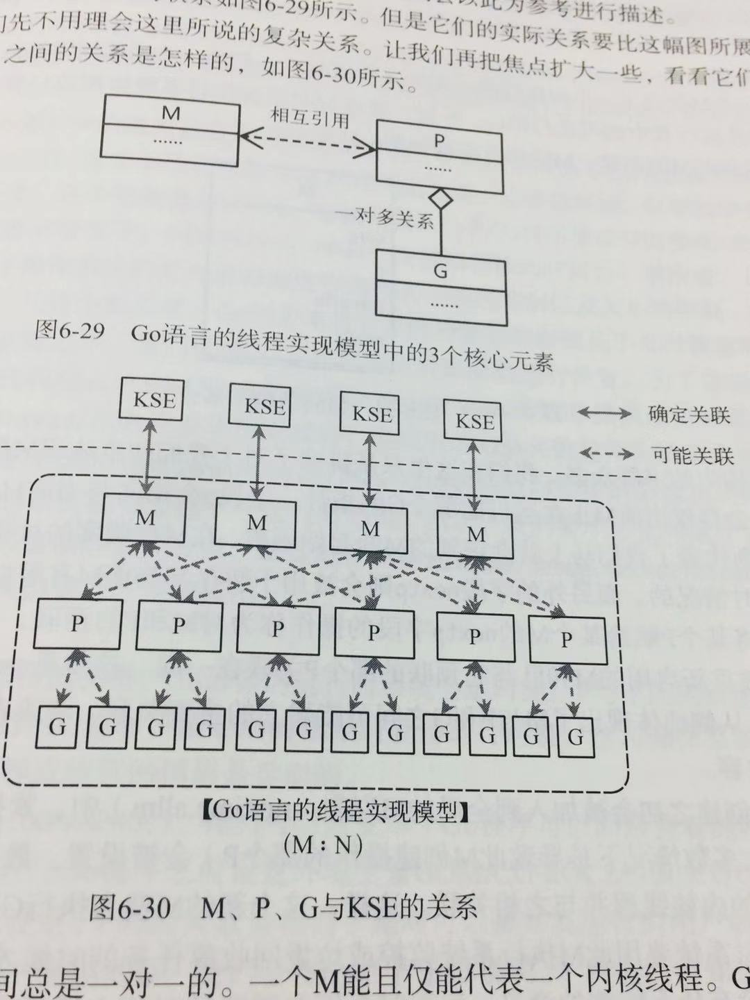

## 闲扯并发模型

并发的核心思想是使多个任务可以在同一时间执行以便更快的得到结果。这个思想是来自于多元操作系统。

### 1 这里需要区分几个概念

#### 1.1 串行程序和并发程序

一个串行程序特指一个只能被顺序执行的指令列表。而一个并发程序指被并发的执行的两个或者两个以上的
串行程序的统称。并发程序允许其中的串行程序运行在一个或多个可共享的CPU上。同时也允许每个串行程序
都运行在专为它服务的CPU上。这个被称为多元程序。多元程序由操作系统内核支持并且提供多个串行程序复
用CPU的方法。这个方法被称为多元处理，多元处理是指计算机中的多个CPU公用一个存储器(内存)，并且在
同一时刻会有多个串行程序分别运行在不同的CPU之上。多源程序和多元处理是串行程序得以并发的理论基础。

### 1.2 并发程序和并行程序

在很多书籍，即使是专门语言的经典书籍中，常常把并发和并行的概念混淆。并发程序是指可以被同时发起执
行的程序，注意只是发起。而并行程序是指被设计成可以在并行的硬件上执行的并发程序。换句话说，我们通
常使用的是用并发语言来实现并发程序，而真正的并行是硬件层面的支持。

### 2.3 并发程序和并发系统

并发程序就是一个程序，不管它被划分成多少个小部分，这些小部分之间只要是有关联的，那么就是一个程序。
个人理解这个就是我们通常所说的进程。而并发系统是，程序与程序之间可通过协商一致的协议进程通讯，并且
他们之间是松耦合的。个人理解这个不仅仅说的是操作系统，更多的是说我们通常的软件架构设计。

### 2 并发程序的特点

由于是并发执行的，所以程序的运行顺序具备不确定性。一个串行程序中的所有活动都是顺序执行的，而一个
并发程序中的活动可能一部分是有序的，另外一部分是无序的。这个特性被称为不确定性。这种不确定性导致了
并发程序的每次运行执行路径都是不同的，即便是在输入数据相同的情况下。

如果并发程序内部需要对一个共享资源进行访问或者需要传递一些数据。在这种情况下，我们就需要协调同步，避
免在并发访问资源时产生数据冲突

解决办法就是，如果程序想访问一个共享资源，就必须请求并获取该资源的访问权限。在访问结束之后，再释放掉
该资源。数据传递是并发程序内部的一种交互方式。协调这种内部通信的方式不一定是通过同步。也可以使用异步
的方式对通信进行管理。这种方式使得数据可以不加延迟的发送给数据接收方。即使在数据接收方还没有准备好。
数据会临时存放在一个通信缓存的数据结构中，

如果多个进程间需要协调完成任务，那么进程间通讯的方式就需要重点考虑，这种多个进程间通讯的方式被称为IPC.

在Linux操作系统，可以使用的IPC方法有多种：
* 基于通讯的IPC方法
    1. 以数据传输为手段的IPC方法
        * 管道(传送字节流)
        * 消息队列(传输结构化的消息对象)
    2. 以共享内存为手段的IPC方法
        * 共享内存区
    3. 网络通信可以使用socket
* 基于信号的IPC方法
    1. 操作系统的信号机制(signal)
* 基于同步的IPC方法
    2. 信号灯
    
### 3 进程和线程的区别

#### 3.1.1 进程的定义
所有的代码都是在进程中执行的。通常把一个程序的执行称为进程。进程被用来描述程序的执行过程。程序和进程
是一对相依的概念。分别描述了一个程序的静态形式和动态特征。

一个进程可以使用系统调用fork创建若干个新的进程。每个子进程都是源自它的父进程的一个副本。它会获得父进
程的数据段和堆栈的副本，并与父进程共享代码段。每个进程都是独立的，子进程对属于它的副本的修改对父进程和
兄弟进程是不可见的。

这里为了提高进程创建的效率，使用了写时复用的技术，就是所有的进程都是共享同一个数据段的，只有当需要对数
据做修改的时候，才会拷贝一个副本。

在类Unix操作系统中，每一个进程都有父进程，所有的进程共同组成的进程树，内核启动进程作为进程树的根负责系
统的初始化工作，它是所有进程的祖先。当然它也有父进程，就是它自己。如果一个进程先于它的子进程结束，那么它
的子进程就变成了孤儿，这些孤儿会被内核启动进程收养。

#### 3.1.2 进程描述符
为了管理进程，内核必须对每个进程的属性和行为进行详细的记录，包括进程的优先级、状态虚拟地址范围以及各种访
问权限。记录进程的这些信息的数据结构就叫做进程描述符。进程ID就包含在其中。

#### 3.1.3 进程的状态
进程可能的状态共有6个：可运行、可中断的睡眠状态、不可中断的睡眠状态、暂停状态或者跟踪状态、僵尸状态和退出
状态:
    
    ps -A -o stat,ppid,pid,cmd |grep -e "^[Rr]"

- [x] 可运行状态(TASK_RUNNING R):处于该状态的进程将要、立刻或正在CPU上运行。可能会看到Rs(包含子进程)
,R+(位于后台的)子进程，RN(低优先级)。当然了如果一个处于R状态的进程到底何时被运行，是不确定的，这个是由进
程调度器来决定的。

- [x] 可中断的睡眠状态(TASK_Interruptible S):进程正在等待某个事件的发生(比如网络连接)，这些进程会被
放入对应事件的等待队列。当事件发生时，就会被唤醒。

- [x] 不可中断的睡眠状态(TASK_UNInterruptible D):这意味着这些进程不会对任何信号做出响应，但并不是说这
些进程永远不运行，就睡死了。处于这些状态的进程通常是由于在等待一个特殊的事件，比如磁盘IO.

- [x] 暂停状态跟踪状态(TASK_STOPPED/TASK_TRACED, T): 向进程发送SIGSTOP信号就会使该进程转入暂停状态，
向正在暂停的进程发送SIGCONT信号会是该进程转为可运行状态。处于跟踪状态的进程会暂停并等待跟踪它的进程对他进行操
作。我们通常使用工具进行断点调试的时候，就是这样的进程。

- [x] 僵尸进程(TASK_DEAD-EXIT_ZOMBIE Z):处于此状态的进程即将结束，进程占用的绝大多数资源也已经被回收，但
是还有一些信息被被删除，比如退出码以及一些统计信息。这些信息之所以保留是因为父进程可能会用到。此时的进程主体已被删
除，只留下一个空壳，所以叫僵尸进程。请注意，僵尸进程是一种正常现象，因为系统调用EXIT的作用只是让进程退出，直接说就
是让一个正常进程转为僵尸进程，但是并不会把它完全销毁。进程的完全销毁是需要父进程来对它收尸的。

那僵尸进程是怎么销毁的呢：父进程一开始会用系统的signal函数为SIGCHLD信号绑定处理函数，也就是调用wait或者waitpid()
等待子进程结束。这样僵尸进程就能够被正常退出。另外即使父进程显示的忽略了该信号，父进程结束，这个僵尸进程会被内核启动进
程收养，它依然可以正常销毁。

**咳咳...各位大姥姥，大家这里有疑问么**
大家假装没有疑问，那么自己自问自答

- [x] 退出状态(TASK_DEAD-EXIT_DEAD, X):进程退出不需要保留退出码以及统计信息，那么进程退出就被被直接处理掉。

#### 3.1.4 进程的空间
我们通常写的代码，或者说执行的程序叫做用户进程，换句话说，就是这个进程是存在于用户空间的。这些进程可以做所有`我们想做且可
以做且被允许做`的动作。但是却不能与其所在的计算机的硬件进行交互。

**咳咳,用户进程不能与硬件进行交互，那我们可以访问磁盘么，比如mysql读数据库**

内核可以与硬件交互，但是它却存在于内核空间中。用户进程是无法访问内核空间的。用户空间和内核空间体现了操作系统对内存的划分。
换句话说，它们共同瓜分了操作系统能够支配的内存区域。

内存区域中的每一个单元都是有地址的。这些地址由指针来标识和定位，也就是内存寻址。在32位和64位操作系统中，内存单元分别为2的
32次方和64次方。但是需要注意的是这里所说的内存地址并非真实的物理地址，而是虚拟地址。由虚拟地址标识的内存空间被称为虚拟内存。
内核会为每个用户进程分配虚拟内存而不是物理内存。每个用户进程都会认为分配它的虚拟内存就是整个用户空间。很明显的井底之蛙，以为
整个世界就那么大。用户进程能访问的也就只有虚拟内存。

那么我们怎么从磁盘读取数据，其实是内核将磁盘的数据读出来存储到内存块。然后操作系统将该内存的地址(注意该内存地址是和虚拟内存
有映射关系的)对应的虚拟地址告诉进程。进程处理完毕后，内存空间并不会被释放，可以保留下来当下次其他进程再访问的时候，可以直接
访问而不需要再访问磁盘，也就是我们常说的内存页面缓存。之所以叫页面是因为内核会把进程的虚拟内存划分为若干页。而物理内存单元的
划分是由于CPU负责的，一个物理内存单元被称为一个页框。不同进程的大多数页都会与不同的页框相对应。

#### 3.1.5 系统调用
我们知道用户进程无法直接操纵计算机的硬件，但是内核可以。而用户进程又无法访问内核空间。所以为了用户进程也可以做一些它想做的事
情，内核会暴露一些接口以供使用。用户进程使用这些接口的行为被称为系统调用。虽然系统调用也是函数，但是它和普通的函数是有区别的，
如果再一个普通函数内部产生了系统调用，那么它的执行将涉及到内核空间的访问。为了保证系统的安全和稳定，内核依据CPU提供的、可以
让进程驻留的特权建立了两个特权状态：用户态和内核态。大部分时间CPU都处于用户态，当用户进程发起系统调用的时候，内核会把CPU从
用户态切换为内核态，而后让CPU执行相应的内核函数。当内核函数执行完毕后，内核会把CPU从内核态切换为用户态，并把执行结果返回给
用户进程。

#### 3.2.1 线程的定义
一个线程可以被看作是某个进程中的一个控制流。一个进程至少要有一个线程，因为至少要有一个控制流持续运行。一个进程的第一个线程
会随着它启动而被创建。这个线程被称为该进程的主线程。一个进程可以包含多个线程,这些线程都是由当前进程中已经存在的线程在执行过程
中所执行的相应的系统调用创建出来的。

一个线程的生命周期不可能逾越其所属的进程的声明周期，也就是说一个线程必须所属于一个进程，不能孤立存在。这里需要注意的是线程的
创建是轻量级的，因为进程的很多资源都会被线程共享，这些被线程共享的资源包括

    在当前进程的虚拟内存中存储的代码段、数据段、堆、信号处理函数
    当前进程所持有的文件描述符
    
所以创建线程只需要创建自己的线程栈，用来保存自己的私有数据，线程和进程一样，也都有属于自己的ID。但是线程ID在系统范围内是可以
不唯一的，只在其所属进程内唯一即可。

#### 3.2.2 系统调用函数

- [x] pthread_create  创建线程
- [x] pthread_cancel  关闭线程: 负责向给定ID的线程发一个关闭请求，并且立即返回，至于何时关闭，线程自己决定。
- [x] pthread_join    连接已终止的线程，该函数会一直阻塞的等待给定ID的那个线程的终止，并把该线程start函数的执行结果返回
给调用线程。如果目标线程已经处于终止状态,那个该函数会立即返回。调用线程接过流程控制权限继续执行后续的代码。如果一个线程是可被连
接的，那么在它终止的时候就必须被连接，否则就会变成一个僵尸线程。僵尸线程不但会浪费系统资源，还是导致进程可创建的线程数减少。
- [x] pthread_detach 将一个线程分离:分离意味着该线程不再是一个可以被连接的线程。分离线程一般是让操作系统内核在目标线程终止
的时候自动进程清理和回收工作，线程自身也是可以被分离的。

线程的终止:
    
* 在线程的的start函数中return会使该线程随着start函数的执行结束而终止
* 如果在主线程中return,则所有的线程都会终止。或者在任意的线程exit,也是如此。
* 但是在主线程中pthread_detach，则只会终止主线程
* 线程分离自身和分离其他线程，主要是砍传递给系统调用函数的线程ID.

#### 3.2.3 线程的安全性

如果一个代码可以被多个线程并发的执行，且总能产生预期的效果，那么就是线程安全的。经常被置于线程安全问题中的就是函数，使函数可
线程安全的标志是可重入。如果一个程序中的所有线程都可以都可以并发的调用一个函数，并且无论他们调用该函数的实际执行情况如何，该
函数都可以产生预期的结果，那么这个函数就是可重入的。任何包含了对共享数据做操作的函数都可以被视为是不可重入的。

线程间交互数据是非常简单的，但是却由于可能产生竞态条件而不得不使用一些同步工具(比如互斥锁)来加以保护

#### 3.2.3 线程模型的实现
线程模型的实现有三种:线程与内核调度模型(KSE)之间的关系：

* 用户级线程模型(多对一线程模型):此模型下的线程是由用户级别的线程库全权管理的。线程库并不是内核的一部分。它
     只被存储在进程的用户空间中。进程中的线程的存在对于内核来说是无法感知的。显然，这些线程也不是
     内核的调度器的调度对象。对线程的各种管理和协调完全是用户级程序的自主行为，于内核无关。应用
     程序在对线程进行操作的时候，并不需要从用户态切换到内核态。
     
        优点:
              1. 因为不存在切换，所以在速度上存在优势。
              2. 对线程的管理不需要内核的参与，所以程序的移植性更强
        缺点： 
              1. 此模型下的多线程并不能够真正的并发,因为线程的管理是用户级程序自主行为，对内核
              而言可见的只有进程。如果这个进程中的一个线程因为I/O操作被阻塞，那么这个进程就会阻塞。
              2. 即使计算机上存在多个CPU,进程中的多个线程也不能分配给不同的CPU运行。对于CPU的负
              载均衡来说，进程的粒度太粗了。因而让不同的进程在不同的CPU上运行的意义也微乎其微
              3. 线程的优先级也形同虚设，因为同一个进程中的线程的优先级只能由进程的优先级决定。
          
* 内核级线程模型(一对一线程模型):该模型下的线程是由内核负责管理的。他们是内核的一部分。应用程序对线程的操作都
必须通过内核提供的系统调用来完成。内核可以对进程的每一个线程进行调度。

        优点: 可以真正实现多线程的并发
        缺点: 内核线程的管理要比用户线程管理的成本高得多。因为线程的管理要不停的在用户态和内核态切换。这样会给
        调度器造成非常大的负担，甚至会影响到整个操作系统的稳定性。所以通常内核级线程模型对一个进程所能创建的线
        程数是有限制的

* 两级线程模型(多对多线程模型):此模型下的一个进程可以多个KSE对应，这和内核级线程模型是一样的。但是与内核级线程
模型不同的是,进程中的线程(应用程序线程)并不与KSE一一对应。

         首先，已被加载到进程的虚拟内存中的实现两级线程模型的线程库会通过操作系统内核创建多个内核级线程。
         然后，它再通过这些内核级线程对应用程序线程进行调度。大多数此类线程库都都可以为实际运行的应用程
         序线程动态的分配若干个内核级线程。
         缺点: 这样的设计使得线程的管理工作更加复杂，因为需要内核和线程库的共同管理才能实现
         优点: 
                1. 内核资源的消耗得以得以大大减少
                2. 线程管理操作的效能得到提高，虽然操作变多了
 因为两级线程模型实现的复杂性，往往不会被操作系统级的开发者采纳。但是，这样的设计模型可以很好的在编程语言的层面
 实现。go的具体实现更加高级和优雅一些。在go的并发编程模型中，不受操作系统内核管理的独立控制流并不被叫做线程，而
 被叫做goroutine.

### 4 简单的聊下不同语言的并发模型
扯了一堆无关的废话，现在正常进入主题,简答的聊下GO、Node、PHP的并发模型

### 4.1 Golang的并发模型
GO的线程模型是依赖于两级线程模型实现的，它的Goroutine可以被看作是应用级线程，但是，实际上，Goroutine背后的支撑
系统远没有这么简答

Go语言的线程模型实现有三个关键要素:

    M: Machine的缩写。一个M代表了一个内核线程
    P: Processeer的缩写。一个P代表了M所需的上下文环境
    G: Goroutine的缩写。一个G代表了对一段需要并发执行的Go语言的封装。
    
一个M在与一个P关联之后，就形成了一个有效的G运行环境。每个P都会包含一个可运行的G队列。在该队列中的G会依次传递给本
环境的P所关联的M而获得运行的时机。

M与KSE总是一一对应的。Go语言的运行时系统用一个M来代表一个内核调度实体。M与KSE之间的关联是稳固的。这个是内核级别
的。剩下的就是用户级的事情了。M与P之间的关联以及P与G之间的关联是易变的。他们的关系会在实际调度过程中发生变化。注
意M与P之间的关联总是一对一的，但是是会变化的，而P与G之间的关联是一对多的。

单个go程序所使用的M的最大数量是可以被设置的。在我们使用命令运行go程序的时候，一个引导程序会先被启动。这个引导程序
会被go程序运行建立必要的环境。引导程序会对M的最大数量进行设置。这个初始值是10000.这意味着，来理想情况下，同时可以
有10000个内核线程被同时运行。

P是使G能够在M中运行的关键。Go语言的运行时系统会适时的让P与不同的M建立或断开关联，以使P中那些可运行的G能够在需要的
时候获得运行时机。这于操作系统内核在CPU之上实时的切换不同的进程或线程的情形是类似的。

可以设置go程序能够间接拥有的P的最大数量。这个P的数量的设置相当于是对可以被并发运行的用户级别的G的数量做出限制。当然
也可以通过设置环境变量GOMAXPROCS来达到相同的目的。对P的数量的限制不意味着可以限制M的数量。如果M因系统调用而被阻塞
的时候，运行时系统会将M和P进行分离。如果这个P的可运行G队列还有未被运行的G,那么运行时系统就会找到一个空闲的M,或者创
建一个新的M,并与P进行关联。所以说如果我们在Goroutine中包含了很多需要系统调用的IO操作，那么即使GOMAXPROCS=1，大
量的M也会被创建。

默认的P的数量是1.因此在默认情况下，不论我们在程序中用go语言启动多少个G，它们都会被阻塞的塞入同一个P的可运行队列中。不
过要注意，正如前文所说，这并不意味着只会有一个与内核线程一一对应的M去运行它们。P的最大数量是256个，这个硬性的限定是因
为Go语言目前还不能保证在数量多于256的更多的P存在的情形下Go程序仍能保持高效。

两级线程模型中一部分的调度任务会由操作系统内核之外的程序承担。在Go语言中，其运行时系统中的调度器会负责这一部分调度任务。
调度的对象主要是M,P,G的实例。

### 4.1 Golang的G0和M0
运行时系统中的的每个M都会拥有特殊的Goroutine,G0.它是由运行时系统在初始化M期间创建并分配给M的。G0包含了各种调度、垃圾
回收和栈管理等程序。

除了每个M都有属于它自己的G0之外，还存在一个runtime.g0。runtime.g0被用于执行引导程序。它是在Go程序所间接拥有的第一个
内核线程中被运行的。这个内核线程也被称为runtime.m0.

### 4.1 Node的并发模型

Node保留了作为后端js的运行平台，保留了前端浏览器和js中那些熟悉的接口，没有改写语言本身的任何特性，依旧是基于作用域和原型链，
区别在于它将前端广泛运用的思想迁移到了服务器。换句话说，Node的就是一个异步IO的模型，语言层面天然就是并行的。在Node中，绝大
多数的操作都是以异步的方式进行调用，从文件读取到网络请求等等。Node将浏览器中应用广泛且成熟的事件概念引入到了后端，配合异步
IO，将事件点暴露给业务逻辑

### 4.2 单线程
Node保持了js在浏览器中单线程的特点。最大好处是不用像多线程编程那样处处在意同步的问题，也没有上下文切换带来的性能开销。
单线程的弱点:

* 无法利用多核CPU
* 错误会引起整个应用退出，应用的健壮性有待商榷
* 大量计算占用CPU导致无法继续调用异步IO

这就像Js与UI公用一个线程一样，js长时间执行会导致UI渲染和响应被中断。在Node中，长时间的CPU占用也会导致后续的异步IO发不出调
用，已经完成的异步IO的回调函数也得不到及时执行。

最早解决这个计算问题的是Google开发的Gears。它启用一个完全独立的进程，将需要计算的程序发送给这个进程，在结果出来后，通过事件将
结果传递回来。后来H5定义的web Worker的标准，Google放弃了Gears,全力支持Web Worker.Web Worker能够创建工作线程来进行计算，
以解决js大量计算导致的UI渲染阻塞的问题。工作线程为了不阻塞主线程，工作线程和主线程的数据是不共享的，它们通过消息传递的方式来传递
结果。

Node采用的是Web Worker相同的思路来解决单线程中大计算量的问题，但它用的是子进程:child_process。
子进程的出现，意味着Node可以从容的应对单线程在健壮性和无法利用多核CPU方面的问题。通过将计算分发到各个子进程，可以将大量计算分解
掉，然后再通过进程之间的事件消息来传递结果,这可以很好的保持应用模型的简单和低依赖。通过Master-Worker的管理方式，也可以很好的管
理各个工作进程(咳咳，首先声明，还不知道这个是咋用的，因为没在线上代码里面看到有这样的应用)。

### 4.3 Node应用场景
从单线程的角度讲，Node处理IO的能力是值得称赞的。所以说Node擅长IO密集型的应用，是没人反对的。Node面向网络且擅长并行IO,能够有效
的组织起更多的硬件资源，从而提供更多的服务。IO密集的优势主要在于Node利用事件的循环机制，而不是启动每一个线程为每一个请求服务，资
源站用极少。那Node是否就不擅长CPU密集型呢,个人感觉，嗯，是的，不是很擅长，但也不是太差，主要是因为Node是依赖V8引擎，而V8的执
行效率是非常高的。同时为了解决大运算导致的后续IO无法发起的问题，我们可以将大的计算任务分解为多个小任务，使得运算能够适时释放，不阻塞
IO的发起。

当然了Node也可以通过编写C/C++扩展的方式更高效的利用CPU,将一些V8不能做到性能极致的地方通过C/C++来实现。如果单线程不能满足需求，
使用了C/C++扩展后还觉得不够，那么就可以通过子进程的方式来解决了。然后通过消息传递的方式在进程间传递结果。

### 4.4 到底Node异步IO是什么样的
个人认为node的异步IO就是对操作系统非阻塞IO的封装,所以Node的异步IO原理也就是内核异步IO的原理。只不过它允许我们把通常的耗时操作可以
书写成异步IO的非阻塞方式去执行。

操作系统对计算机进行了抽象，将所有的输入输出设备抽象为文件。内核在进行文件IO操作时，通过文件描述符进行管理，而文件描述符类似于应用程序
与系统内核之间的交流凭证。应用程序如果需要IO调用，需要先打开文件描述符，然后再根据文件描述符去实现文件的读写。此处阻塞IO和非阻塞IO的区
别在于阻塞IO完成获取整个获取数据的过程，而非阻塞IO不带数据直接返回，要获取数据，还需要通过文件描述符，再次读取。

非阻塞IO存在的问题在于。由于完整的IO并没有完成，立即返回的并不是业务期望的数据，而仅仅是当前调用的一个状态。为了获取完整数据，应用程序
需要重复调用IO操作来确认是否完成。就是我们通常所说的轮询。轮询带来的弊端是，它会让CPU处理状态判断，这是对CPU资源的浪费。所以Node的并
发模型核心在于它使用的轮询是否高效。

目前的主流轮询技术：
- [x] READ: 最原始，性能最低下。通过重复调用来检查IO状态的完成来获取数据。
- [x] SELECT: READ基础上的改进，通过对文件描述符上的事件状态进项判断。用一个1024长度的数组来存储状态，所以最多可以同时检查1024个。
- [x] poll: SELECT的改进版，采用链表的方式避免数组长度的限制(个人疑问链表是顺序遍历的，那么会不会带来问题呢)。
- [x] epoll: 在进入轮询的时候，如果没有检查到IO事件，将会进入休眠，直到事件发生将它唤醒，它是真是的利用了事件通知、执行回调的方式，而
不是遍历查询，所以不会浪费CPU。

所以现在主流的轮询技术是使用epoll的，但是问题又来了，事件轮询的进程在休眠期间，是闲置的，这是对资源的浪费。我们期望的完美的异步IO应该是
应用程序发起非阻塞调用。无须通过遍历或者事件唤醒等方式轮询，可以直接处理下一个任务，只需要在IO完成后通过信号或者回调的方式将数据传递给应
用程序即可。那么有这种完美的方式么，有，但是只有在Linux下有，AIO,而且存在缺陷，AIO仅仅支持内核IO中的O_DIRECT方式读取，无法利用系统缓存

### 4.4.1 那么Node中的异步IO又是怎么样的情形呢？

在进程启动时，Node便会创建一个类似于while(true)的循环(事件循环)，每执行一次循环体的过程，我们称之为Tick。每个Tick的过程就是查看是否有事件待
处理，如果有，就取出事件及其相关的回调函数，如果有回调函数就执行。然后进入下个循环，如果不再有，就退出进程（这里有点疑问，目前还没搞明白）

当然了这个事件循环其实遍历的是事件队列，当用户的网络请求或者其他的异步操作到来时，node都会把它放到事件队列里，此时并不会立即执行它，代码也不会阻
塞,继续往下走，直到主线程代码执行完成。

### 4.4.2 观察者
在每个Tick的过程中，如何判断是否有事件需要处理？这里需要引入观察者的概念。每个事件循环中有一个或者多个观察者，而判断是否有事件要处理的过
程就是向这些观察者询问的过程。这个过程类似于饭馆的厨房，厨房一轮一轮的制作菜肴，具体制作哪些，取决于收银台收到的客人下单。厨房每次做完一轮菜，
就去问小姐姐，下来还有没有要做的，没有就打烊了。

###
结束了，本来还要补充下PHP的并发模型的，
1 作文写得有点长，hold不住了
2 PHP的并发主要是建立在SWOOL的基础上，本人对SWOOL不是很熟悉，所以就呵呵了，期待下个大佬继续分享。

