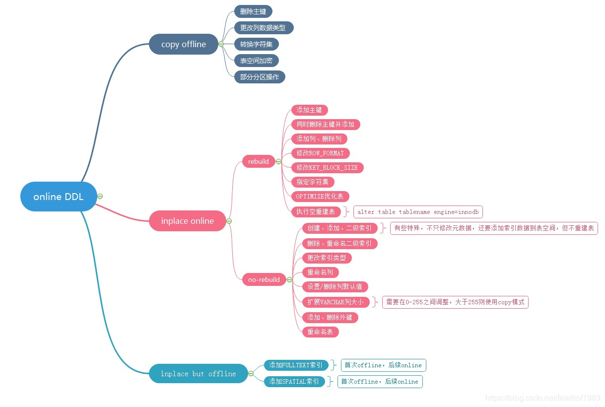
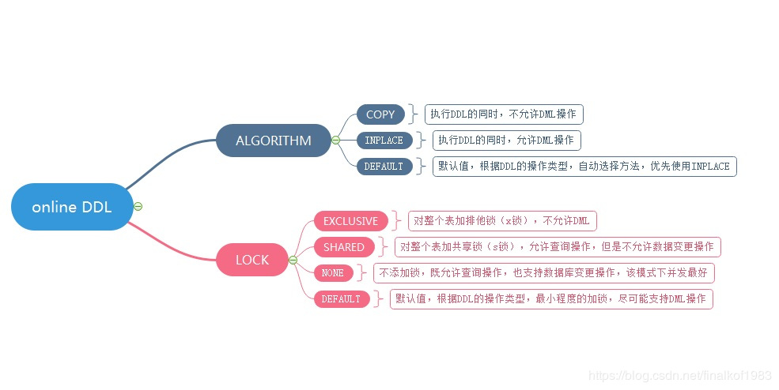

Mysql5.6以后引入了Online DDL,执行过程如下：

1 建议一个临时文件，扫描原表的所有数据页

2 用数据页中的记录生成B+ tree,存储到临时文件

3 生成临时文件的过程中，将所有对原表的操作记录在一个日志文件(row log)中。

4 临时文件生成后，将日志文件中的操作应用到临时文件，得到一个逻辑数据与原表相同的数据文件

5 用临时文件替换原表的数据文件。

当然了在执行Alter语句的时候，是需要获取MDL写锁的，但是在真正执行数据拷贝之前，这个写锁就退化成读锁了。是为了实现online,所以原表还是可以进行正常的写操纵的。

对于一个大表来说，Online DDL最耗时的过程就是拷贝数据到临时表的过程。这个期间是可以增删改操作的。所以，相对于整个DDL过程来说，锁的时间非常短，可以认为是Online的。

推荐使用工具:[gh-ost](https://github.com/github/gh-ost),在原始表空闲的时候，将数据从原始表缓慢且增量的复制到幻影表，同时同步正在进行的更改到缓存表，最后在适当的时候，用幻影表替换原表。同时支持暂停、恢复、终止。

ALTER TABLE engine = Innodb 是重建表recreate
analyze table t 只是对表的索引信息做重新统计
optimize table t 相当于是recreate + analyze

Online DDL大体可以分为3部分：
1 copy(ALGORITHM=COPY) 这部分是offline的，在ddl执行期间其他DML不能并行，也就是5.6版本之前的DDL执行方法。期间生成临时表(Server层的操作支持所有引擎)，用于写入原表修改过的数据，同时在原表路劲下会生成临时表的.frm和.idb文件。在Innodb中部支持inplace的操作都会自动使用copy方式执行，而MyISAM表只能使用copy方式。

2 inplace(ALGORITHM=INPLACE)所有操作在Innodb引擎层完成，不需要经过临时表的中转。除了空间索引和全文索引的创建外，其他以inplace方式执行的操作都是online的，执行期间其他DML操作可以并行。其中涉及到是否需要重建表

  添加主键，增加、删除字段，都需要重建表
  增加，删除，修改二级索引，修改表名称不需要重建表
  注意:删除主键、修改字符集，更改列数据类型都是copy方式(offline)的
  
  rebuild会在原表路径下创建新的.frm和.ibd文件，消耗的IO会比较多。期间会申请row-log空间记录原表的DML操作，这部分操作会在DDL提交阶段应用到新的表空间中。
  
  norebuild除了会产生二级索引的写入操作外,其余操作均只修改元数据项，即只在原表路径下差生.frm文件，不会申请row-log,不会消耗过多的IO,速度通常很快。
  
3 inplace but offline的几种特殊DDL操作，虽然是按照inplace方式执行，但是执行期间DML语句不能并行。

区分DDL语句是copy还是inplace方式，只需要查看语句执行完成的输出结果中X rows affected,如果为0则是inplace(online)方式，如果不为0则是copy(offline)方式。

online DDL的两个子选项包括ALGORITHM和LOCK:
对于ALGORITHM的参数使用default就可以，不需要强制指定。系统会自己判断，优先使用inplace,对于不支持的表或者DDL才会使用copy.

LOCK参数大部分情况下也是不需要显示指定的，默认值default已经是尽可能允许DML并行操作了。

[相关介绍](https://blog.csdn.net/finalkof1983/article/details/88355314)

补充说明：
给表设置默认值:ALTER TABLE users ALTER phone SET DEFAULT  '';
