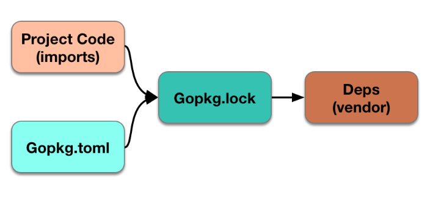

使用原始的包管理 go get的弊端：

    * go get的代码是作为GOPATH下全局依赖，并且没有版本控制
    * go get管理依赖必须设置GOPATH
    
dep 
    引入vendor目录作为依赖管理目录。
    
    
### 安装
    
    curl https://raw.githubusercontent.com/golang/dep/master/install.sh | sh
    
### 初始化目录

    dep init -v
    
初始化完成之后，会在当前目录生成：Gopkg.lock、Gopkg.toml、vendor

    Gopkg.lock 定义了所有依赖项目的详细信息，自动生成的不可修改
    Gopkg.toml 依赖管理的核心文件，可手动修改。Gopkg.toml里面只定义了项目直接依赖项，而
                Gopkg.lock里面除了包含Gopkg.toml中的所有项，还包含间接依赖项。例如我们的
                的项目依赖A、B、C.而A又依赖B、C.那么只有A会包含在Gopkg.toml中，而A、B、C
                都定义在Gopkg.lock中
    vendor     项目优先从这个目录找依赖代码。
    

    
### 命令

    dep status 查看项目依赖的状态
    dep ensure 安装项目依赖的代码
    dep ensure -update 更新项目依赖
    dep ensure -add 添加项目依赖

### 说明 dep是不支持在把$GOPATH/src作为项目根目录的，所以必须要另外再新建一个目录，否则会报错：
    
    dep does not currently support using GOPATH/src as the project root
