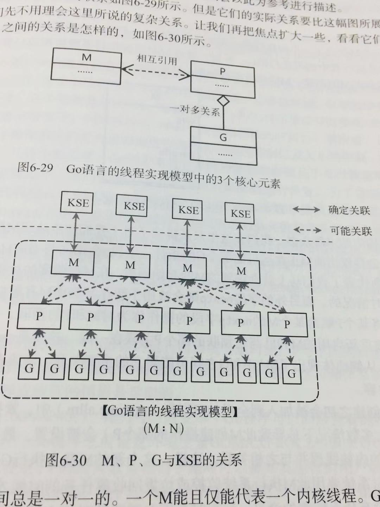

go的线程实现模型是依赖于两级线程模型实现的理论，它的goroutine可以被看作是应用级
线程，但是，实际上，Goroutine背后的支撑体系远没有这么简单。

Go语言的线程模型实现的3个必知要素：
    
    M: Machine的缩写。一个M代表了一个内核线程
    P: Processeer的缩写。一个P代表了M所需的上下文环境
    G: Goroutine的缩写。一个G代表了对一段需要并发执行的Go语言的封装。

一个M在于一个P关联之后，就形成了一个有效的G运行环境。每个P都会包含一个可运行的G队列
。在该队列中的G会依次传递给本环境的P所关联的M而获得运行的时机。

M与KSE总是一一对应的。Go语言的运行时系统用一个M来代表一个内核调度实体。M与KSE之间
的关联是稳固的。这个是内核级别的。剩下的就是用户级的事情了。M与P之间的关联以及P与G
之间的关联是易变的。他们的关系会在实际调度过程中发生变化。注意M与P之间的关联总是一
对一的，但是是会变化的，而P与G之间的关联是一对多的。

单个go程序所使用的M的最大数量是可以被设置的。在我们使用命令运行go程序的时候，一个
引导程序会先被启动。这个引导程序会被go程序运行建立必要的环境。引导程序会对M的最大数
量进行设置。这个初始值是10000.这意味着，来理想情况下，同时可以有10000个内核线程被
同时运行。

    设置内核级线程M的数量：
    import "runtime/debug"
    s := debug.SetMaxThreads(100)
    这个函数会设置M同时返回默认的值
    
    
P是使G能够在M中运行的关键。Go语言的运行时系统会适时的让P与不同的M建立或断开关联，以
使P中那些可运行的G能够在需要的时候获得运行时机。这于操作系统内核在CPU之上实时的切换
不同的进程或线程的情形是类似的。

通过调用函数

        runtime.GOMAXPROCS()

可以设置go程序能够间接拥有的P的最大数量。这个P的数量的设置相当于是对可以被并发运行的
用户级别的G的数量做出限制。当然也可以通过设置环境变量GOMAXPROCS来达到相同的目的。对
P的数量的限制不意味着可以限制M的数量。如果M因系统调用而被阻塞的时候，运行时系统会将M和P
进行分离。如果这个P的可运行G队列还有未被运行的G,那么运行时系统就会找到一个空闲的M,或者
创建一个新的M,并与P进行关联。所以说如果我们在Goroutine中包含了很多需要系统调用的IO操
作，那么即使GOMAXPROCS=1，大量的M也会被创建。
   
   
默认的P的数量是1.因此在默认情况下，不论我们在程序中用go语言启动多少个G，它们都会被阻塞的
塞入同一个P的可运行队列中。不过要注意，正如前文所说，这并不意味着只会有一个与内核线程一一
对应的M去运行它们。P的最大数量是256个，这个硬性的限定是因为Go语言目前还不能保证在数量多于
256的更多的P存在的情形下Go程序仍能保持高效。

两级线程模型中一部分的调度任务会由操作系统内核之外的程序承担。在Go语言中，其运行时系统中的
调度器会负责这一部分调度任务。调度的对象主要是M,P,G的实例。

G0和M0
    
   运行时系统中的的每个M都会拥有特殊的Goroutine,G0.它是由运行时系统在初始化M期间创建并分配
   给M的。G0包含了各种调度、垃圾回收和栈管理等程序。
   
   除了每个M都有属于它自己的G0之外，还存在一个runtime.g0。runtime.g0被用于执行引导程序。
   它是在Go程序所间接拥有的第一个内核线程中被运行的。这个内核线程也被称为runtime.m0.
   

