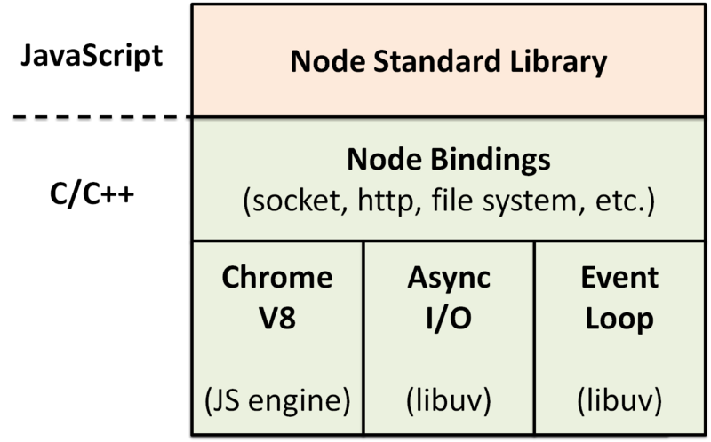

### Node是什么

Node.js 不是一门语言也不是一个框架，也不是像Nginx的Web服务器。它只是基于Google V8 引擎提供的一个js运行环境，
同时结合Libuv扩展了js的功能，使之支持io,fs等操作系统的功能。Libuv是一个高性能，事件驱动的I/O库，并且提供了跨
平台的API.Node最早使用的是Libev，但是Libev只能在Unix操作系统下运行，Windows、FreeBSD、Linux(epoll)等内
核使用的事件通知相应的机制是IOCP。libuv提供了一个跨平台的抽象，由平台决定是使用libev或IOCP.我们知道Node是
事件驱动的异步I/O模型。其中的异步函数就是由Libuv的事件循环处理库来处理这些I/O操作的，隐藏了非阻塞I/O的具体细节
，简化了并发编程模型，让你可以轻松的编写高性能的Web应用。事件循环和线程池都是由Libuv来提供的

Node Bindings做的事就是将Chrome 暴露的C/C++接口转成JS Api,并且结合这些Api编写了Node标准库，所有这些标准
库统称为Node.js SDK

### I/O的异步模型有哪些

### 什么是I/O密集型，什么是计算密集型的，如何区分

### Node的应用场景
Node的应用场景比较多，比如Web开发、微服务、前端构建等。Node通常被用来开发低延迟的网络应用，也就是那些只
需要在服务端环境和前端实时收集和交换数据的应用(Api，即时聊天，微服务)。Node编写的包管理器npm已成为开源包
管理的领域最好的生态。Node被吐槽的最多的一点是：回调太多难于控制(俗称地域回调)和CPU密集型任务执行的不是
很好。但是,目前已经有了Promise,async/await的技术，可以轻松的满足日常需求。如果要解决CPU密集型的任务，
可以考虑Rust来扩展Node,但是比较麻烦。推荐使用Node的兄弟项目fibjs,它是基于纤程，效率非常高，兼容npm,
同时没有异步回调的烦恼

