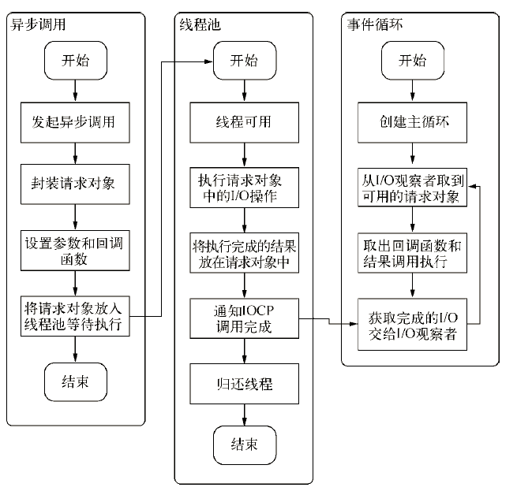

### node的异步模型引发的思考
nodejs的最大亮点是事件驱动，非阻塞IO，这使得Node有很强的并发处理能力，非常适合编写网络应用。在node中
大部分操作几乎都是异步的，所以我们处理的IO操作基本上都需要再回调函数中处理。
但是一直以来对node的异步模型的应用场景都不是很理解，所以百度了下，这里先罗列下node异步模型的一些基本概念

#### 1.1 IO操作概述
IO操作分为：单线程串行依次执行和多线程并行执行

多线程的代价在于创建线程消耗内存、执行期线程上下文切换消耗CPU，以及面临锁，状态同步

单线程按照顺序依次执行，不用担心线程安全的问题，代码编写简单，但是任何一个稍慢都会直接导致后续的执行代码阻塞

在node中利用单线程，远离了死锁，利用异步IO,解决了阻塞的问题

#### 1.2 异步IO的实现

事件循环: 在启动进程时，创建一个死循环，依次查看是否有事件需要处理

观察者：每个事件循环中有一个或这多个观察者，判断是否有事件要处理的过程就是向这些观察者询问是否有要处理的事件

请求对象：从js发起调用到内核执行完IO操作的过渡过程中，存在一种中间产物，就是请求对象

IO线程池：组装好请求、送入IO线程池等待执行，完成第一步IO操作，进入第二步回调通知

#### 错误概念纠正
node的单线程指的是主线程是单线程的，由主线程按照编码顺序一步步执行程序代码，假如遇到同步代码阻塞,
主线程被占用，后续的程序代码执行就会被卡住。

#### 串讲node

js是解释型语言，代码按照编码顺序一块一块被压进stack里面执行，执行完成后移除，然后继续压下一块代码块进去执行。
当主线程接受了一个request请求后，程序被压进同步执行的代码块，如果在执行期间有第二个请求进来就会被压进stack
里面直到第一个请求处理完成，后面的请求都会被挂起等待前面同步执行完成后再执行。

那么问题来了，一个单线程的效率为何可以这么高，可以同时处理数万级的并发不回阻塞？

这就要依赖于事件驱动/事件循环/线程池

每个node进程只有一个主线程在执行程序代码，形成一个执行栈

主线程之外，还维护了一个"事件队列"(Event Queue)。当用户的网络请求或者其他的异步操作到来时，node都会把它放到
事件队列里，此时并不会立即执行它，代码也不会被阻塞，继续往下走，直到主线程代码执行完成。

主线程代码执行完成后，再通过事件循环机制(Event loop),开始到事件队列的开头取出第一个事件，从线程池中分配一个线
程去执行这个事件，接下来再取出第二个事件，再从线程池中分配一个线程去执行，然后再下一个，主线程不断的检查事件队
列中是否有未执行的事件，直到事件队列中所有的事件都执行完成了，此后每当有新的事件加入到事件队列中，都会通知主线
程按顺序取出交由Event loop处理

